# YSHOP 意象宠物管理系统

> 专为宠物门店打造的数字化经营一站式解决方案，覆盖收银 · 寄养 · 笼位 · 日历 · 订单 · 库存 · 会员 · 宠物档案，助力门店实现运营标准化、数字化与高效化。

**官网：** [https://www.yixiang.co/](https://www.yixiang.co/)  
**在线演示：** [https://www.yixiang.co/p/chongwuguanlixitong.html](https://www.yixiang.co/p/chongwuguanlixitong.html)  
**开源地址：** [GitHub](https://github.com/guchengwuyue/yshop-pet) · [Gitee](https://gitee.com/guchengwuyue/yshop-pet)

---

## 产品简介

YSHOP 意象宠物管理系统是一款专为中小型宠物店打造的经营管理系统，面向宠物门店、宠物服务中心、宠物洗护寄养俱乐部等宠物服务类经营主体量身设计。

系统全面适配宠物门店数字化经营全流程，帮助门店告别社群接单、手写台账等传统低效模式，覆盖服务项目上架、后台一站式收银、笼位状态管控、服务日历提醒、订单管理、商品库存、会员与宠物档案、企业组织等核心环节，实现业务线上标准化统一管控。

**定位：** 收银 → 寄养 → 笼位 → 日历 → 订单 → 库存 → 会员 → 宠物档案

**适用：** 宠物门店（商品零售、洗护美容等综合服务） / 宠物服务中心 / 宠物洗护寄养俱乐部 / 其他宠物服务类经营主体

**核心能力：** 一站式收银台 · 确认结账多支付 · 二维矩阵笼位管控 · 寄养登记与退房 · 服务日历提醒 · 订单全生命周期 · 商品/服务/寄养上架 · 采购入库 · 宠物档案与复购建议 · 会员等级折扣 · 企业组织权限

---

## 功能列表

| 模块 | 功能 | 业务价值 |
|------|------|----------|
| 一站式收银台 | 扫码录入、会员切换、商品/服务/寄养混合结算、挂单、会员充值 | 一个界面完成全部日常收银，降低学习成本与出错概率 |
| 确认结账 | 选择宠物、微信/支付宝/现金支付、优惠金额、一键抹零、余额展示 | 结账流程清晰可控，高峰收银更快更准 |
| 二维矩阵笼位管控 | 笼位分类、批量添加笼位、颜色状态（空闲/入住/在住/退房）、KPI 统计 | 笼位使用情况实时可视，避免超卖与空置浪费 |
| 寄养登记与退房 | 入住/预计离店、天数自动计算、笼位分配、实际离店确认退房 | 寄养收费与笼位管控一次完成，服务信息不遗漏 |
| 服务日历提醒 | 天/周/月视图、待处理/已联系/已完成/已逾期状态、时间轴日程 | 洗护预约与服务提醒不遗漏，逾期一目了然 |
| 订单管理 | 全部/已完成/已退款筛选、单号与支付方式查询、金额明细、取消订单 | 订单全生命周期可查，财务对账更轻松 |
| 商品与服务上架 | 商品/服务/寄养三类、分类筛选、单/多规格、库存预警、批量导入 | 店内售卖与服务项目统一管理 |
| 采购入库 | 选品扫码、供应商、审核/反审核、打印、入库时序与出库盘库 | 无需额外购置进销存系统，日常库存轻松管控 |
| 宠物档案 | 品种/花色/体重/生日/绝育、主人信息、服务记录时间线、复购建议 | 客户与宠物信息完整沉淀，服务更有针对性 |
| 会员体系 | 会员等级（图标/背景色/折扣率）、充值活动、充值订单、余额记录 | 提升高价值用户的留存率与复购率 |
| 企业组织 | 组织树、员工、角色、部门、岗位、导入导出、账号启停 | 适配多门店协同与权限管控 |

---

## 演示与咨询

| 入口 | 说明 |
|------|------|
| **在线演示** | [https://www.yixiang.co/p/chongwuguanlixitong.html](https://www.yixiang.co/p/chongwuguanlixitong.html) |
| **官网** | [https://www.yixiang.co/](https://www.yixiang.co/) |
| **开源仓库** | [GitHub yshop-pet](https://github.com/guchengwuyue/yshop-pet) · [Gitee yshop-pet](https://gitee.com/guchengwuyue/yshop-pet) |
| **二开与定制** | 欢迎联系意象团队获取演示账号与定制方案 |

如果对您有帮助，欢迎点右上角 **Star** 支持一下。

QQ 交流群（入群前请先 Star）：**544263002**  
群内有视频教程与开发文档。

---

## 效果图展示

以下为后台实际界面效果，完整体验请访问 [在线演示](https://www.yixiang.co/p/chongwuguanlixitong.html)。

### 收银台与结账

| | |
|:---:|:---:|
| 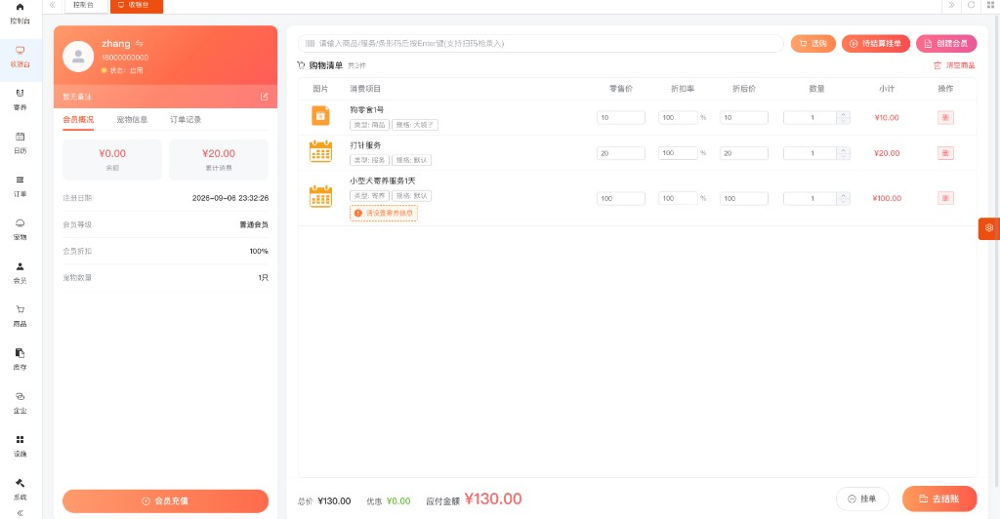 | 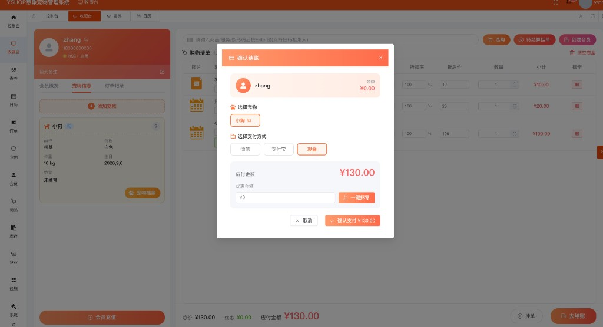 |

### 寄养与笼位

| | |
|:---:|:---:|
| 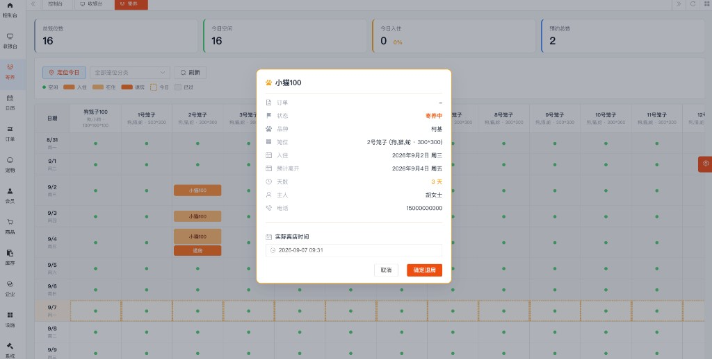 | 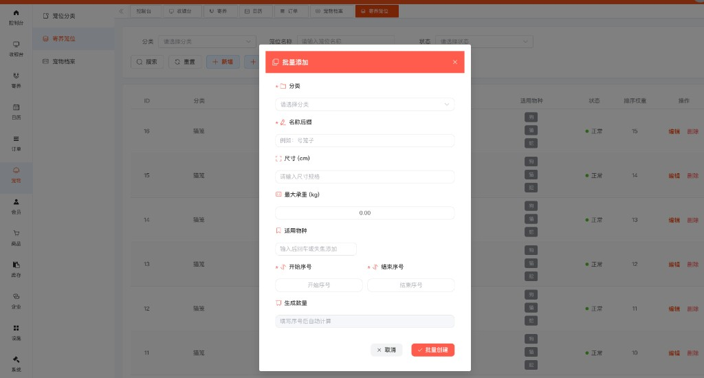 |

### 服务日历与订单

| | |
|:---:|:---:|
| 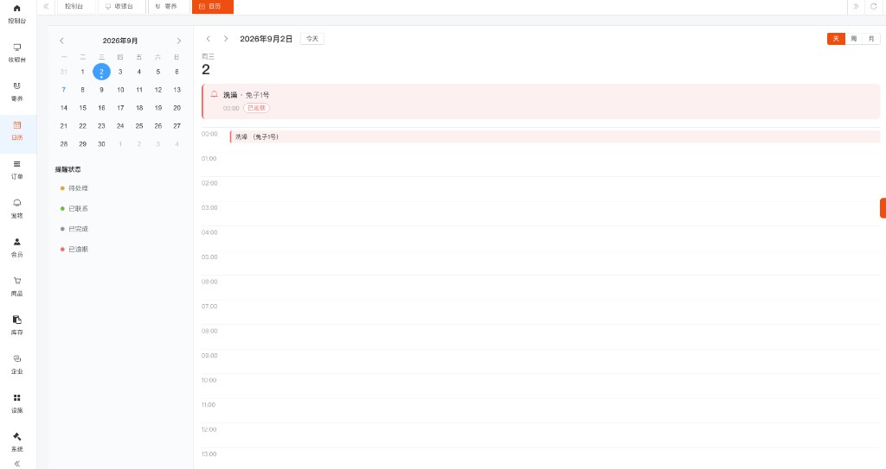 | 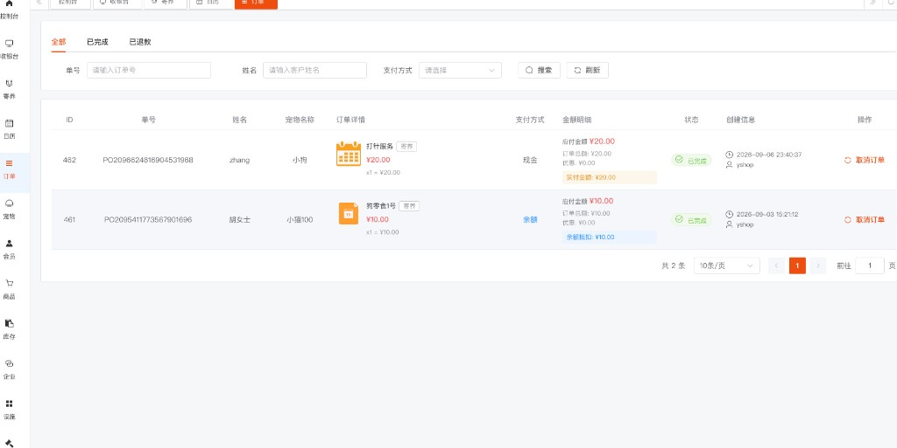 |

### 商品与库存

| | |
|:---:|:---:|
| 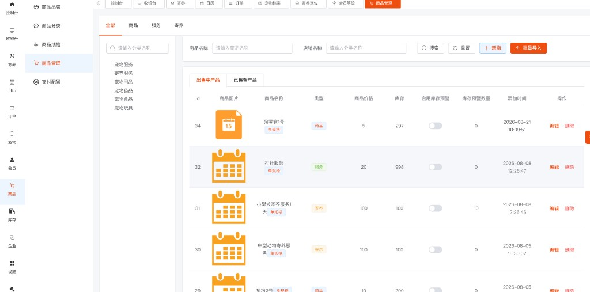 | 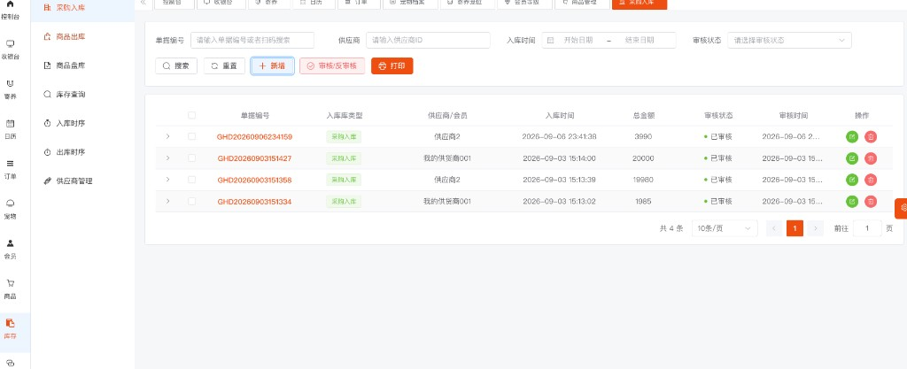 |

| |
|:---:|
| 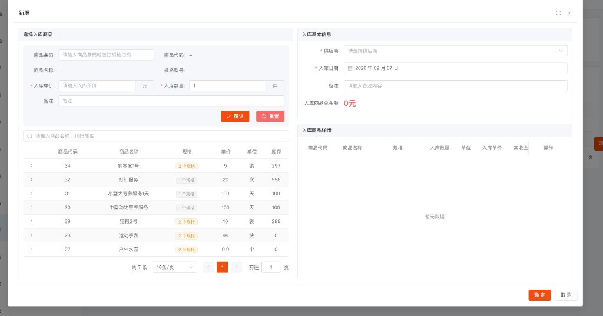 |

### 宠物档案与会员

| | |
|:---:|:---:|
| 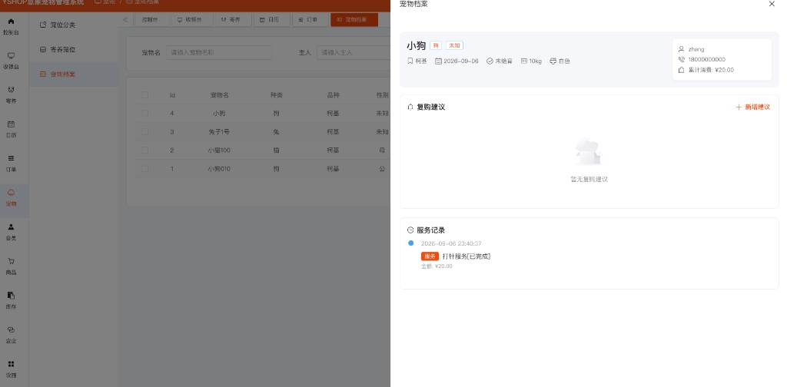 | 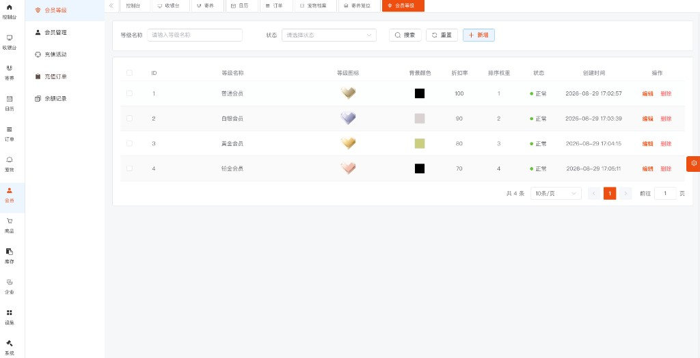 |

### 企业组织

| |
|:---:|
| 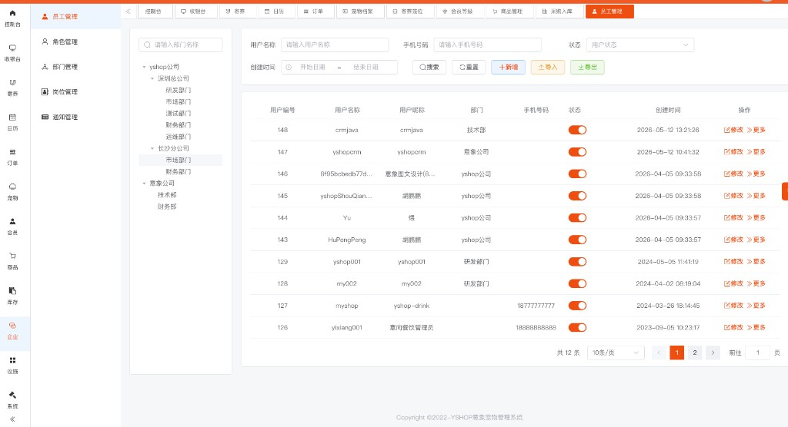 |

---

## 后台截图（补充）

### 一站式收银台

| | |
|:---:|:---:|
|  |  |

### 笼位与寄养

| | |
|:---:|:---:|
|  |  |

### 商品与库存

| | |
|:---:|:---:|
|  |  |

### 会员体系

| |
|:---:|
|  |

---

## 系统优势

- **标准化：** 服务上架、收银结算、寄养登记、库存管理全流程线上统一标准，减少对人工经验的依赖
- **数字化：** 客户、宠物、商品、笼位、订单、日历数据全部数字化沉淀，经营决策有据可依
- **高效化：** 一站式操作配合自动化状态同步，门店日常运营效率显著提升
- **易上手：** 界面简洁直观，操作路径短，员工学习成本低、快速上手
- **可追溯：** 消费、充值、库存、寄养、服务记录全程留痕，经营风险可控

---

## 技术栈

**后端：** Spring Boot 3 · Spring Security OAuth2 · MyBatis / MyBatis-Plus · Redis · Lombok / Hutool

**前端：** Vue 3 · Element Plus · UniApp（Vue 3）

---

## 特别鸣谢

- [ruoyi-vue-pro](https://gitee.com/zhijiantianya/ruoyi-vue-pro)
- [Element Plus](https://element-plus.org/)
- [Vue](https://cn.vuejs.org/)
- [pay-java-parent](https://gitee.com/egzosn/pay-java-parent)
- [uvui](https://www.uvui.cn/)
- [UniApp](https://uniapp.dcloud.net.cn/)

---

## 开源协议

本项目采用比 Apache 2.0 更宽松的 [MIT License](https://github.com/guchengwuyue/yshop-pet/blob/master/LICENSE) 开源协议。

个人与企业可 100% 免费使用，无需保留类作者、Copyright 信息。

---

YSHOP 意象宠物管理系统，让宠物店经营更简单、更高效、更专业，全面助力宠物服务门店实现数字化升级。
