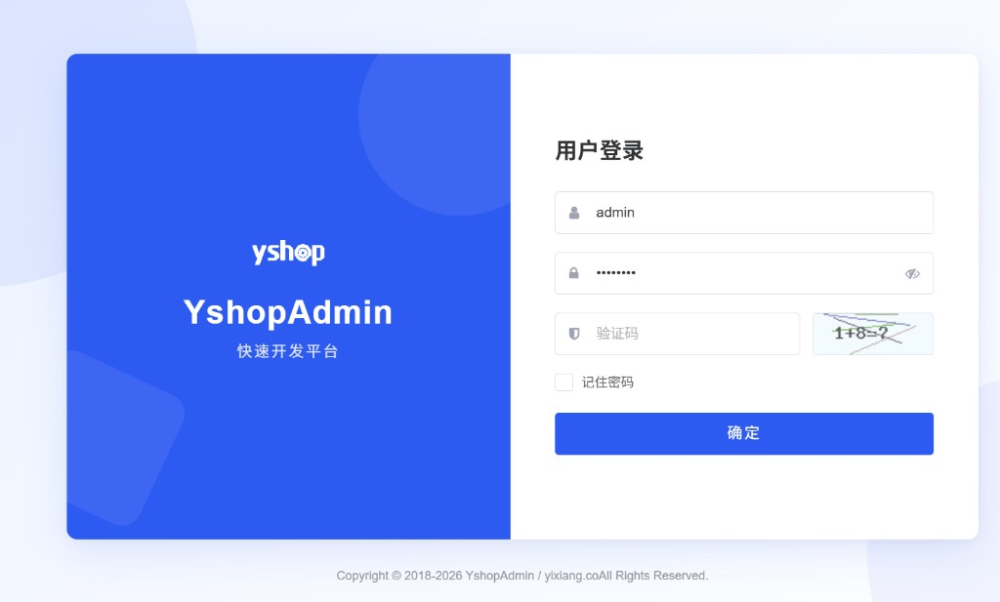
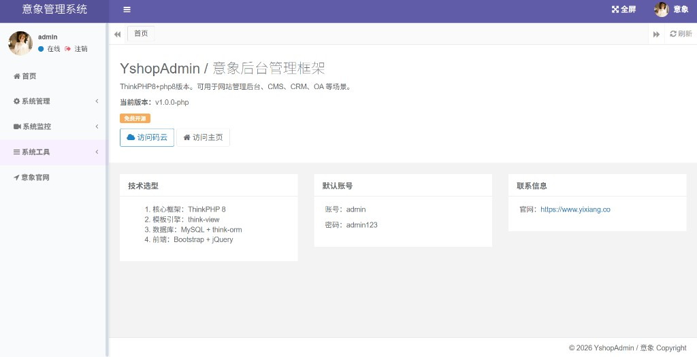
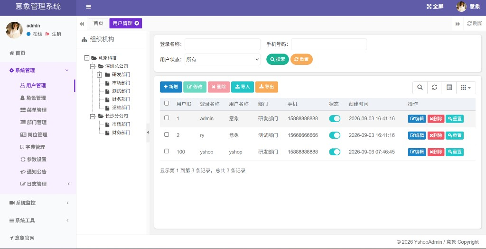
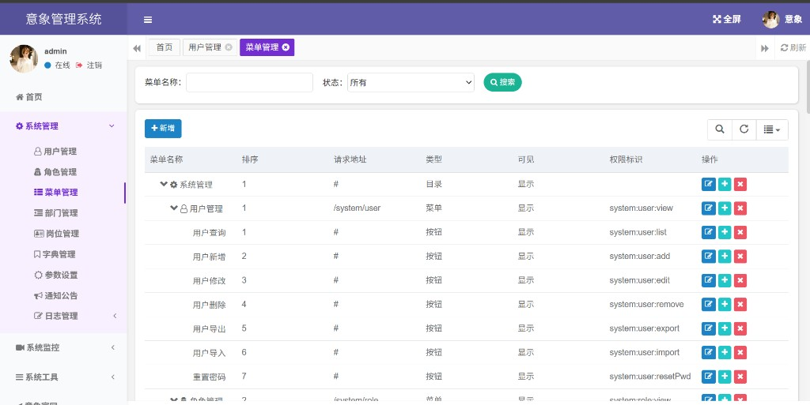
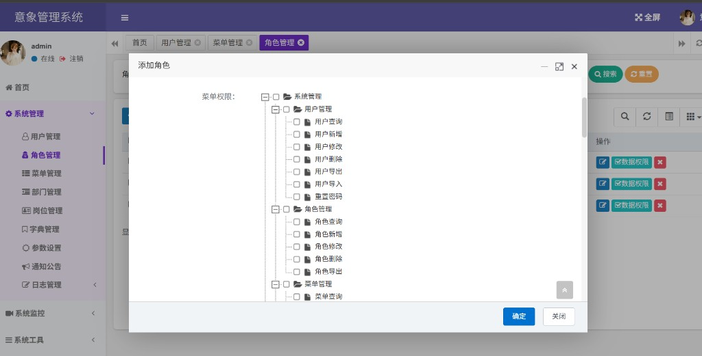
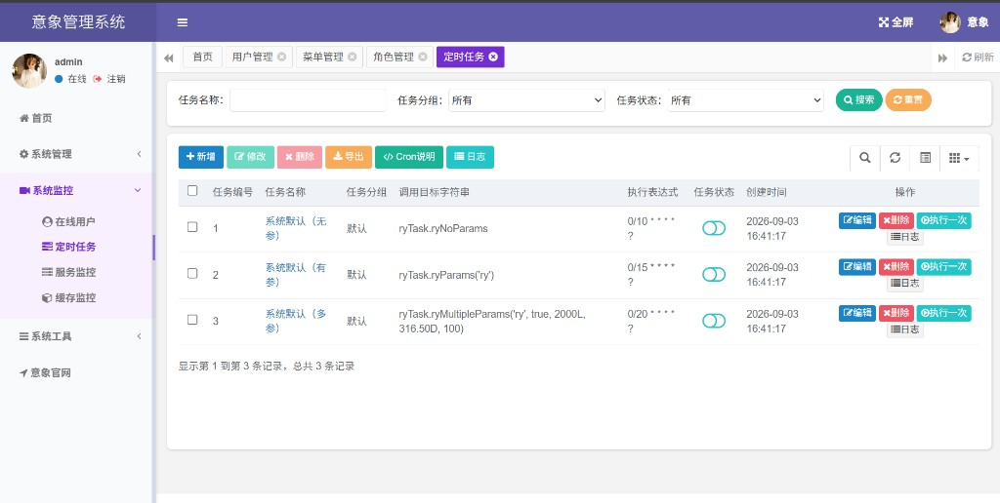
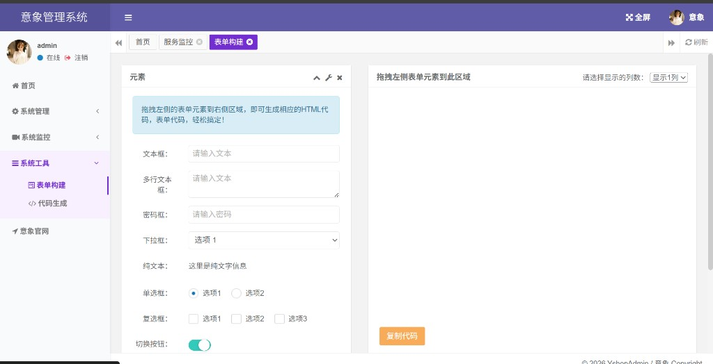
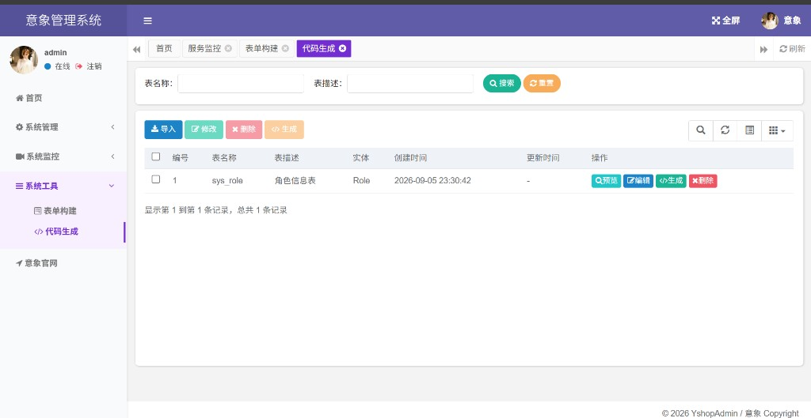

# YshopAdmin 快速开发平台

基于 **ThinkPHP 8** 的权限后台快速开发平台

[](https://www.php.net/)
[](https://www.thinkphp.cn/)
[](https://www.mysql.com/)
[](./composer.json)

---

## 概述

- YshopAdmin 快速开发平台：通用权限管理后台，开箱即用，聚焦业务快速交付
- 登录鉴权、RBAC 权限、数据范围、系统管理、监控运维、代码生成、Excel 导入导出一体具备
- Session + 中间件鉴权，think-view 服务端渲染，部署依赖少（PHP + MySQL 即可）
- 默认 file 缓存 / Session，不强制 Redis，轻量易扩展
- 系统内置**插件管理**（`系统管理 → 插件管理`）：扫描 `addons/` 目录，支持安装 / 启用 / 禁用 / 卸载与本地 zip 安装，业务能力可按需扩展、互不影响。


```
如果对你有帮助，欢迎 Star 收藏，谢谢！
```
## 快速开始

完整的环境要求、安装部署、账号说明与常见问题，请直接查看在线文档：

- 在线文档：https://cms.yixiang.co/doc/


建议从文档中的 **环境部署**、**快速了解** 开始。

## 演示地址

- 在线演示：https://cms.yixiang.co/
- 账号：`admin` / 密码：`admin123`

### 演示效果


















## 技术栈

### 后端

- 核心框架：ThinkPHP 8 + think-view + think-orm
- Excel：PhpSpreadsheet（导入 / 导出 / 模板）
- 鉴权：Session + `AuthCheck` / `Permission` / `OperLog` 中间件
- 权限模型：RBAC（菜单权限标识）+ 数据范围
- 分页约定：`PageHelper`
- 缓存 / Session：默认 **file**（可选 Redis，非必须）
- 定时任务：`php think job:run` + 任务白名单

### 前端

- jQuery + Bootstrap + bootstrap-table + zTree + layer
- 静态资源目录：`public/`（`/css`、`/js`、`/ajax` 等）
- 列表交互：`$.table` / `$.treeTable` / `$.operate` / `$.modal`

## 内置功能

1. **用户管理**：系统操作者配置，支持导入导出与重置密码
2. **部门管理**：组织机构树（公司 / 部门 / 小组）
3. **岗位管理**：用户职务配置
4. **菜单管理**：目录 / 菜单 / 按钮权限标识
5. **角色管理**：菜单权限与数据范围分配
6. **字典管理**：系统固定数据项维护
7. **参数设置**：系统动态参数配置
8. **通知公告**：公告信息发布与维护
9. **操作日志**：写操作审计记录与查询
10. **登录日志**：登录记录查询；支持账号解锁
11. **在线用户**：当前会话用户查看与强制下线
12. **定时任务**：任务 CRUD / 启停 / 执行一次 / 执行日志
13. **服务监控**：CPU、内存、磁盘、PHP、操作系统信息
14. **缓存监控**：配置 / 字典等缓存查看与清理
15. **表单构建**：拖拽式表单构建页
16. **代码生成**：导入数据表，预览 / 下载 PHP CRUD 骨架
17. **个人中心**：资料与密码维护

## 项目结构

```text
YshopAdmin/
├── app/
│   ├── controller/          # 控制器（system / monitor / tool）
│   ├── service/             # 业务逻辑 XxxService
│   ├── common/              # Auth、PageHelper、AjaxResult、ExcelUtil…
│   ├── middleware/          # AuthCheck、Permission、OperLog、DemoMode
│   ├── model/               # 少量模型（多数业务用 Db::name）
│   ├── job/                 # 定时任务目标
│   └── command/             # 控制台命令（含 job:run）
├── config/                  # ThinkPHP 配置
├── database/sql/            # SQL 脚本
├── public/                  # Web 根目录（静态资源 + index.php + doc/）
├── route/app.php            # 全部 HTTP 路由与权限注解
├── view/                    # think-view 模板
├── runtime/                 # 缓存、日志、导出临时文件
├── .env                     # 本地环境
└── README.md
```

新增业务模块时：`controller` + `service` + `view` + `route/app.php` 同步落地，菜单与权限写入系统菜单表。

## 优势

1. 权限、数据范围、操作日志开箱即用，业务只需补 CRUD
2. 依赖少（PHP + MySQL 即可），上手与部署成本低
3. 代码生成可快速产出 PHP CRUD 骨架，减少重复劳动
4. 自带 Docsify 在线文档，便于团队协作与交付说明
5. 结构清晰，便于二次开发与模块扩展

## 特别鸣谢
- [ruoyi](https://github.com/yangzongzhuan/RuoYi) — 若依系统
- [ThinkPHP](https://www.thinkphp.cn/) — PHP 应用框架
- [PhpSpreadsheet](https://github.com/PHPOffice/PhpSpreadsheet) — Excel 读写
